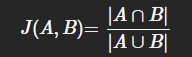

# Laboratorio 2
## Jorge Sierra y Sara Garcia

### Objetivo
Con el desarrollo de este laboratorio usted:

1. Construirá un motor de búsqueda de cursos de la Javeriana
2. Construirá un rastreador web que rastrea una copia de sombra del catálogo universitario para construir un índice simple.

### Herramientas que se van a usar:

- Python:

    - requests (para conexiones http y recuperardocumentos)
    - html5lib y beautifulsoup4 (mejorar entendimiento de html)
    - urllib.parse (para analisis de URLS)
    - selenium (para la extraccion de paginas dinamicas)
    - re (permite tokenizar texto)
    - csv (manejo de archivos csv)
    - collections.deque (Cola del rastreador)

### pasos:

1. Lo primero a realizar fue el crawler:
    1. Implementamos parte del codigo requerido por las especificaciones en el docuemnto pdf en la clase util, en este hay 3 funciones: get_request(url), el cual realiza una petición HTTP GET y devuelve un objeto response, read_request(request) Que el cuerpo de la petición y lo devuelve, y is_url_ok_to_follow(url: str, domain: str) que determina si la url es concuerda con lo que buscamos
    2. Despues lo que se hizo fue una forma de traer los paths de los cursos, la cantidad de cursos extraidos depende de la cantidad indicada por el usuario
    3. Esos cursos se guardaban en una cola y de ahi se van sacando para extraer informacion de ciertas partes de su html (Título del curso, Presentación del programa y Objetivos del curso)
    4. Posterior a eso se guarda en un archivo las palabras mas repetidas de la informacion extraida, este archivo es un csv
    5. para terminar se coge el archivo csv y se hace una traduccion a un script de sql

2. En segundo lugar se realizó el compare:
    El archivo compare.py toma el archivo csv (salida del crawler: output.csv) y en base a este se hace la comparación utilizando la métrica Jaccard.
    1. Funciones utilizadas:
      - load_from_csv(): Se encarga de abrir el archivo output.csv en modo lectura, después lee cada línea con ayuda de csv.reader utilizando "|" como delimitador, se contruye un diccionario con la forma { course_id: set(palabras) }. Utilizando set para evitar duplicados, en donde la clave es el identificador único de cada curso y el valor es el conjunto de palabras que aparecen en su título y descripción.
      - jaccard(set1,set2): De esta forma se calcula la similitud de Jaccard, que consiste en retornar un valor entre 0 y 1 dependiendo de su similitud. 
      - compare(curso1,curso2): Función en donde se carga el índice con load_from_csv(), verificando que ambos ids de curso existan en el diccionario, se obtienen los conjuntos de palabras de cada curso y llama a la función jaccard para obtener su similitud, finalmente se imprime el resultado con 3 decimales junto con la lista de tokens que los dos cursos tienen en común.

      2. EJECUCIÓN: python compare.py <curso1_id> <curso2_id>
      - EJEMPLO DE USO: py compare.py innovacion-educativa-creatividad innovacion-sostenible-y-gestion-del-conocimiento-para-pymes
      - SALIDA ESPERADA: Similitud Jaccard entre 'innovacion-educativa-creatividad' y
        'innovacion-sostenible-y-gestion-del-conocimiento-para-pymes': 0.250
        Tokens en común: ['duración', 'horas', 'innovación', 'precio']

3. En tercer lugar se realizó el buscador_csv:
   Buscador de cursos que permite ingresar una lista de intereses (palabras clave) y devuelve las URLs de los cursos más relevantes basándose en el índice generado por el crawler.
   1. Funciones utilizadas:
    - normalize(text: str): Función que se encarga de convertir texto a minúsculas y elimina tildes utilizando unicodedata, de esta forma se que las comparaciones de palabras no se vean afectadas por mayúsculas o caracteres con tilde.
    - search(keywords: list[str], top_k: int = 10): Función que recibe una lista de palabras clave y un número máximo de resultados. Carga el csv y construye un diccionario: { course_id: set(palabras_normalizadas) }.
    Finalmente se calcula la relevancia para cada curso contando cuantas palabras de la consulta están presentes en su conjunto de palabras, se ordena los cursos de mayor a menor score, se recontruye cada URL (https://educacionvirtual.javeriana.edu.co/<course_id>) y finalmente devuelve una lista de tuplas (url, score) de los cursos más relevantes.

    2. EJECUCIÓN: python buscador_csv.py
    - SALIDA ESPERADA: Cursos más relevantes:
        https://educacionvirtual.javeriana.edu.co/curso-musica-basica  (relevancia 0.67)
        https://educacionvirtual.javeriana.edu.co/introduccion-a-la-composicion  (relevancia 0.33)

    3. Métrica de relevancia utilizada: relevancia = (palabras de la consulta que aparecen en el curso​)/(total de palabras de la consulta)

Preguntas del laboratorio: 

Dada la consulta de una palabra en los cursos de la Universidad, ¿cómo mostrar las URLs por orden de relevancia?  

Defina una métrica de similitud para comparar dos cursos.  

Dado un listado de intereses, por ejemplo [‘musica’, ‘composicion’, ‘instrumento’], el buscador debe retornar los cursos que más se relacionan a los intereses del usuario. ¿cómo se define una medida de similitud entre los cursos, y entre los cursos e intereses? ¿son dos métricas diferentes? ¿puede usar la misma métrica del punto anterior? ¿cuáles son las desventajas de usar la misma métrica, y cómo se mide el rendimiento? 

Respuestas: 

Se utilizó el índice invertido generado por crawler.py (archivo dummy.csv). 
Para una palabra de consulta se filtran las entradas del CSV que la contienen y se construye la URL de cada curso (https://educacionvirtual.javeriana.edu.co/<course_id>). 

El orden de relevancia puede definirse por la frecuencia de aparición de la palabra en cada curso. 
Con el índice actual la relevancia es binaria (la palabra aparece o no), por lo que las URLs pueden mostrarse en orden alfabético, sin embargo, para que haya un ranking real, habría que extender el índice para guardar las frecuencias. 

Tal como se implementó en compare.py, se utiliza la similitud de Jaccard para comparar dos cursos, que se calcula como: 

donde A y B son los conjuntos de palabras de cada curso. 
Esta es una forma sencilla de calcular ya que no depende de la longitud de los documentos y funciona bien para comparar cursos representados como conjuntos de tokens. 

Para intereses [musica, composicion, instrumento], se construye un conjunto con esas palabras y se calcula la similitud de Jaccard entre ese conjunto y el conjunto de palabras de cada curso (explicado más detallado en la respuesta anterior). 
Sin embargo, hay ciertas desventajas ya que no pondera frecuencia, no reconoce sinónimos ni contexto. 
El rendimiento se mide por tiempo de búsqueda y, si se dispone de datos de verdad, por métricas de recuperación como precisión y recall. 

Conclusiones:

1. No deben haber ni muchas ni pocas palabras clave sino un valor equilibrado (como por ejemplo 5), ya que si hay muchas los valores se acercaría la comparacion mucho a cero y en caso contrario no se podría evaluar bien la similitud.

2. La parte de html del codigo que queriamos analizar se creaba con javascript, por ende para extraerla bien tuvimos que usar herramientas mas complejas que la libreria requests (selenium), ya que con selenium se puede extraer lo que el javascript cargue

3. toca descartar muchas palabras que generalizxan mucho o que hacen ruido para comparar, pero si se quitan muchas palabras generales no se podran encontrar similitudes
